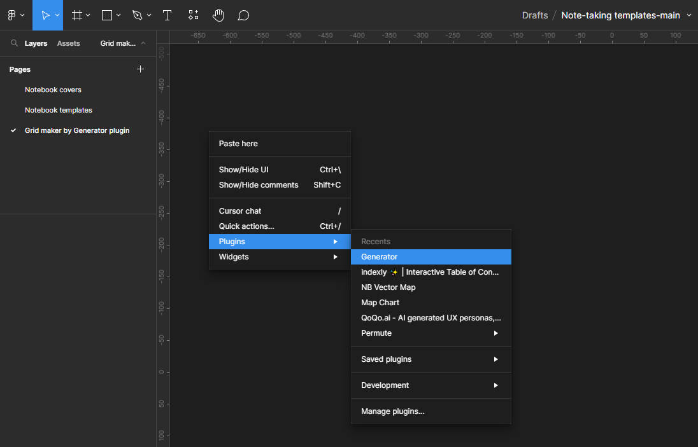
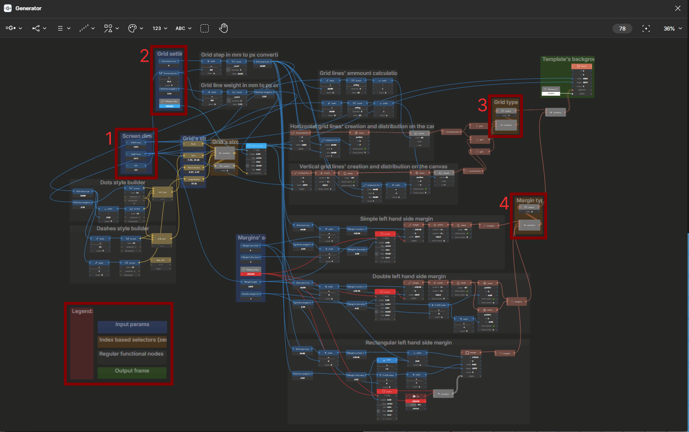

# Opinionated Note-Taking Templates for E-Ink Tablets

[](https://github.com/Sterh20/note-taking-templates/stargazers)
[](https://github.com/Sterh20/note-taking-templates/network/members)
[](https://github.com/Sterh20/note-taking-templates/watchers)
[](https://github.com/Sterh20/?tab=followers)
[](https://opensource.org/license/agpl-v3/)


[](https://www.figma.com/community/plugin/899028246731755335)


This repository contains original note-taking templates and notebook covers for E-Ink readers made in Figma. Additionally, there is an easy-to-use and highly customizable tool for making grids built with a nocode node-based editor in Figma.

The aim of this project is to bring the e-ink note-taking community together and create high-quality templates. If you want to better understand why the templates are the way they are, read the [philosophy behind this project](#philosophy-behind-this-project) section of this readme.

---

- [Opinionated Note-Taking Templates for E-Ink Tablets](#opinionated-note-taking-templates-for-e-ink-tablets)
  - [Dev Requirements](#dev-requirements)
  - [How to Use Grid Maker](#how-to-use-grid-maker)
  - [Philosophy Behind This Project](#philosophy-behind-this-project)
    - [Minimalism and Simplicity](#minimalism-and-simplicity)
    - [Accessibility](#accessibility)
    - [Maintainability](#maintainability)
  - [Gallery](#gallery)
    - [Templates](#templates)
    - [Notebook Covers](#notebook-covers)
  - [Scripts](#scripts)
    - [CopyTemplates](#copytemplates)
      - [Parameters](#parameters)
      - [How It Works](#how-it-works)
      - [Usage](#usage)
      - [Output](#output)
  - [Devices Spec Tables](#devices-spec-tables)
  - [Known Issues/Todos](#known-issuestodos)
  - [How to Contribute](#how-to-contribute)
  - [License](#license)

## Dev Requirements

- [**Figma**](https://www.figma.com/)
- [**Generator plugin**](https://www.figma.com/community/plugin/899028246731755335) for pattern and grids generation

## How to Use Grid Maker

1. Open the [FIG file](/src/Note-taking%20templates-main.fig) in Figma.
2. Install the [Generator plugin](https://www.figma.com/community/plugin/899028246731755335).
3. Navigate to the **"Grid maker by Generator plugin"** page in Figma's file.
4. Open the Generator plugin on this page:

   <details>

   <summary>Screenshot:</summary>

    

   </details>

5. If everything is OK, you will see a Generator canvas (see the screenshot below) and its result on Figma's canvas. In the bottom left corner of the Generator's canvas, there is a legend for this project. For an average user, the most important elements are the blue and orange boxes:
   - **Blue boxes** are input parameters. You probably only need to change screen dimensions (1) and grid settings (2) to suit your needs.
   - **Orange boxes** are switches for changing between pre-made variants of the grids. The switches are zero-index based. To change a variant, modify the "select" node. You likely only need to change the grid type (3) and margin type (4) to suit your needs.

   <details>

   <summary>Screenshot:</summary>

   

   </details>

6. If, after changing the input parameters, the **grid** you were making **disappears** from Figma's canvas, it means that you deactivated the output frame. To reactivate it, **double-click on the frame node in the green panel** in the top right corner of the Generator's canvas.
7. To save the generated result, copy it to another page. If you don't copy the result and close the Generator's canvas window, the generated result will disappear with the window. If you open the Generator's canvas on the same page again, the generated result will reappear.

## Philosophy Behind This Project

**This is not a collection of community-built templates** (like [this](https://supernote-templates.mostlyuseful.tech/) or [this](https://rm.ezb.io/)). This project is focused on building quality templates; the emphasis is on **quality over quantity**. To ensure quality, the templates are designed based on the following guiding principles:

### Minimalism and Simplicity

Minimalism is the most important principle that guides the templates in this repo. After reviewing various templates from [Reddit](https://www.reddit.com/r/Supernote/?f=flair_name%3A%22Custom%20Templates%22) and repositories and comparing them to templates professionally made by [Fujitsu/Sony and Shuhaly](https://www.fmworld.net/digital-paper/tool.html), I concluded that for everyday note-taking, **you don't really need a fancy template**. What <u><b>you really need</b></u> is a grid or lined template to provide guidance, consistency, and a better user experience.

<details>

<summary>Continue reading:</summary>

You don't really need [captions in your templates](https://www.reddit.com/r/Supernote/comments/y8xq8c/template_meeting_templates/) if you use them often. After several uses, you'll remember where everything is and won't need captions anymore. If you can assume the function of a specific part of the template from the context or if the specific part is visually highlighted/separated, you don't need captions. So, why make them in the first place (assuming you don't share your notes with someone else)? Why would you need to put the name of your template inside the [template](https://www.reddit.com/r/Supernote/comments/1385qku/weekly_planner_a6x/)? You don't.

The thing that you really need is **a space to write**. As much as possible. You can't flip pages as quickly or view them side by side as you can with conventional analog notebooks. By this logic, maximization of screen real estate for writing is paramount. So, by default, everything that is taking space in the templates of this repo is considered a waste of space unless it is serving some important and specific function, which should be **communicated in the description for the template or by real-world usage examples** (which is preferred) attached to the preview of the template. If you don't really need something - **cut it out**. Usage of [KISS](https://en.wikipedia.org/wiki/KISS_principle) principle is highly encouraged.

But what could be essential, you ask? Everything that is **repeating and would be tedious or annoying to write by hand** every time you use a template (e.g., days of the week, hours in a day, some important captions, or icons, or margins, etc.), **ruler guides**. If you are absolutely sure that a user will benefit from an element in a template (and in the case of things that can become obsolete like precise date and years - if you will assume the responsibility to update it **for the rest of your life**) - use it; otherwise, use the KISS principle.

</details>

### Accessibility

Accessibility in terms of the average user's skill level, design choices, and file formats is needed to unlock the creative capacities of the community. One of the goals of this project is to provide building blocks for making new templates, which will be (hopefully) shared within the appropriate local community of your device alongside with the SVG sources. As it stands now, most of the templates are shared in PNG format, which makes it difficult to modify, customize, or use as a base for new templates in a meaningful way. **The user shouldn't have to be a CS engineer or professional designer** to make or modify templates for a note-taking device.

<details>

<summary>Continue reading:</summary>

**Figma** was chosen as the main tool for this project for its **popularity, ease of use** for newbies or for experienced vector graphic designers, its **UX, and extensibility by plugins**. Figma is a closed-source software, and FIG files are a proprietary binary file format, which is not a good thing for an open-source git project, but the ease of use and extensibility of the tool outweigh these flaws in my view. This project will not use any pro or paid feature of Figma or its plugins for accessibility sake, so there shouldn't be a problem in the future. I'm aware of [Penpot](penpot.app), but it doesn't have extensions yet. If in the future Penpot's developers add extensions and someone will make a similar extension to the [Generator](https://www.figma.com/community/plugin/899028246731755335), I will migrate this project to Penpot.

The templates **are built** and will be built if possible/applicable **with respect to UI margins of our devices** and the fact that the users have different hand sizes and different styles of writing. It's an impossible task to take everything into account, but it is possible to **keep this in mind** while developing a new template.

All templates will be exported from Figma to PNG and SVG files for licensing purposes and **for people who don't know how to use Figma** or don't want to learn how to use it, so they could also participate in their own capacity and share their work with their respective communities on Reddit or wherever so others can build upon their work.

</details>

### Maintainability

That's easy - **if the project becomes unmaintainable, it will die**. Due to the usage of binary files, this project is complex in terms of version control. So, while accessibility is a good thing, moderation is the key. **There will be sacrifices**.

<details>

<summary>Continue reading:</summary>

For example, all captions will be in English, there will be only one surface color in each category, and so on. In order to have one source of truth and easily customize your own copy, this project is heavily relying upon Figma's [variables](https://help.figma.com/hc/en-us/articles/15339657135383-Guide-to-variables-in-Figma) and [styles](https://help.figma.com/hc/en-us/articles/360039238753-Styles-in-Figma). Using those features makes it easy to be consistent in design decisions and make less mistakes.

At this point, **I don't see the reason to add more fonts/font styles** to the project, but if you really know what you are doing - go ahead. If you want to change it for personal use - it's easy. You just need to change the font of the project's text style in one place, and that's it. By the same logic, all colors (except for notebook cover artworks) should be tokenized.

For the sake of maintainability, all artwork and icons are created by me, generated [algorithmically](https://hide.lizz.website/) or by using an [AI](https://app.recraft.ai/community). The proper attribution for original authors of [CC BY 4.0](https://creativecommons.org/licenses/by/4.0/) licensed artworks would be a pain to maintain in Figma, and I would have to check proper attribution for pull requests myself, which is a labor-intensive task. So, **only original artworks or artworks without attribution ([CC0](https://creativecommons.org/publicdomain/zero/1.0/))** will be used in this project.

</details>

## Gallery

### Templates

<details>

<summary><b>Solid grid:</b></summary>

| 5 mm grid |
| :---: |
|  |

Link | Type | DPI | Resolution | Author |
| ---| ---  | --- | --- | --- |
|[5 mm grid at 227 DPI - 1404x1872](src/1404x1872/templates/solid-grid/5%20mm%20grid%20at%20227%20DPI%20-%201404x1872.png) | PNG | 227 | 1404x1872 | [Sterh20](https://github.com/Sterh20) |
|[5 mm grid at 227 DPI - 1404x1872](src/1404x1872/templates/solid-grid/5%20mm%20grid%20at%20227%20DPI%20-%201404x1872.svg) | SVG | 227 | 1404x1872 | [Sterh20](https://github.com/Sterh20) |

---

| 5 mm grid with a solid margin |
| :---: |
|  |

Link | Type | DPI | Resolution | Author |
| ---| ---  | --- | --- | --- |
|[5 mm grid at 227 DPI - with a solid margin - 1404x1872](src/1404x1872/templates/solid-grid/5%20mm%20grid%20at%20227%20DPI%20-%20with%20a%20solid%20margin%20-%201404x1872.png) | PNG | 227 | 1404x1872 | [Sterh20](https://github.com/Sterh20) |
|[5 mm grid at 227 DPI - with a solid margin - 1404x1872](src/1404x1872/templates/solid-grid/5%20mm%20grid%20at%20227%20DPI%20-%20with%20a%20solid%20margin%20-%201404x1872.svg) | SVG | 227 | 1404x1872 | [Sterh20](https://github.com/Sterh20) |

---

| 5 mm grid with a double-line margin |
| :---: |
|  |

Link | Type | DPI | Resolution | Author |
| ---| ---  | --- | --- | --- |
|[5 mm grid at 227 DPI - with a double-line margin - 1404x1872](src/1404x1872/templates/solid-grid/5%20mm%20grid%20at%20227%20DPI%20-%20with%20a%20double-line%20margin%20-%201404x1872.png) | PNG | 227 | 1404x1872 | [Sterh20](https://github.com/Sterh20) |
|[5 mm grid at 227 DPI - with a double-line margin - 1404x1872](src/1404x1872/templates/solid-grid/5%20mm%20grid%20at%20227%20DPI%20-%20with%20a%20double-line%20margin%20-%201404x1872.svg) | SVG | 227 | 1404x1872 | [Sterh20](https://github.com/Sterh20) |

---

| 5 mm grid with a thick half-transparent margin line |
| :---: |
|  |

Link | Type | DPI | Resolution | Author |
| ---| ---  | --- | --- | --- |
|[5 mm grid at 227 DPI - with a thick half-transparent margin line - 1404x1872](src/1404x1872/templates/solid-grid/5%20mm%20grid%20at%20227%20DPI%20-%20with%20a%20thick%20half-transparent%20margin%20line%20-%201404x1872.png) | PNG | 227 | 1404x1872 | [Sterh20](https://github.com/Sterh20) |
|[5 mm grid at 227 DPI - with a thick half-transparent margin line - 1404x1872](src/1404x1872/templates/solid-grid/5%20mm%20grid%20at%20227%20DPI%20-%20with%20a%20thick%20half-transparent%20margin%20line%20-%201404x1872.svg) | SVG | 227 | 1404x1872 | [Sterh20](https://github.com/Sterh20) |

</details>

<details>

<summary><b>Dotted grid:</b></summary>

| 5 mm dotted grid |
| :---: |
|  |

Link | Type | DPI | Resolution | Author |
| ---| ---  | --- | --- | --- |
|[5 mm dotted grid at 227 DPI - 1404x1872](src/1404x1872/templates/dotted-grid/5%20mm%20dotted%20grid%20at%20227%20DPI%20-%201404x1872.png) | PNG | 227 | 1404x1872 | [Sterh20](https://github.com/Sterh20) |
|[5 mm dotted grid at 227 DPI - 1404x1872](src/1404x1872/templates/dotted-grid/5%20mm%20dotted%20grid%20at%20227%20DPI%20-%201404x1872.svg) | SVG | 227 | 1404x1872 | [Sterh20](https://github.com/Sterh20) |

---

| 5 mm dotted grid with a solid margin |
| :---: |
|  |

Link | Type | DPI | Resolution | Author |
| ---| ---  | --- | --- | --- |
|[5 mm dotted grid at 227 DPI - with a solid margin - 1404x1872](src/1404x1872/templates/dotted-grid/5%20mm%20dotted%20grid%20at%20227%20DPI%20-%20with%20a%20solid%20margin%20-%201404x1872.png) | PNG | 227 | 1404x1872 | [Sterh20](https://github.com/Sterh20) |
|[5 mm dotted grid at 227 DPI - with a solid margin - 1404x1872](src/1404x1872/templates/dotted-grid/5%20mm%20dotted%20grid%20at%20227%20DPI%20-%20with%20a%20solid%20margin%20-%201404x1872.svg) | SVG | 227 | 1404x1872 | [Sterh20](https://github.com/Sterh20) |

---

| 5 mm dotted grid with a double-line margin |
| :---: |
|  |

Link | Type | DPI | Resolution | Author |
| ---| ---  | --- | --- | --- |
|[5 mm dotted grid at 227 DPI - with a double-line margin - 1404x1872](src/1404x1872/templates/dotted-grid/5%20mm%20dotted%20grid%20at%20227%20DPI%20-%20with%20a%20double-line%20margin%20-%201404x1872.png) | PNG | 227 | 1404x1872 | [Sterh20](https://github.com/Sterh20) |
|[5 mm dotted grid at 227 DPI - with a double-line margin - 1404x1872](src/1404x1872/templates/dotted-grid/5%20mm%20dotted%20grid%20at%20227%20DPI%20-%20with%20a%20double-line%20margin%20-%201404x1872.svg) | SVG | 227 | 1404x1872 | [Sterh20](https://github.com/Sterh20) |

---

| 5 mm dotted grid with a thick half-transparent margin line |
| :---: |
|  |

Link | Type | DPI | Resolution | Author |
| ---| ---  | --- | --- | --- |
|[5 mm dotted grid at 227 DPI - with a thick half-transparent margin line - 1404x1872](src/1404x1872/templates/dotted-grid/5%20mm%20dotted%20grid%20at%20227%20DPI%20-%20with%20a%20thick%20half-transparent%20margin%20line%20-%201404x1872.png) | PNG | 227 | 1404x1872 | [Sterh20](https://github.com/Sterh20) |
|[5 mm dotted grid at 227 DPI - with a thick half-transparent margin line - 1404x1872](src/1404x1872/templates/dotted-grid/5%20mm%20dotted%20grid%20at%20227%20DPI%20-%20with%20a%20thick%20half-transparent%20margin%20line%20-%201404x1872.svg) | SVG | 227 | 1404x1872 | [Sterh20](https://github.com/Sterh20) |

</details>

<details>

<summary><b>Dashed grid short:</b></summary>

| 5 mm short dashed grid |
| :---: |
|  |

Link | Type | DPI | Resolution | Author |
| ---| ---  | --- | --- | --- |
|[5 mm short dashed grid at 227 DPI - 1404x1872](src/1404x1872/templates/dashed-short-grid/5%20mm%20short%20dashed%20grid%20at%20227%20DPI%20-%201404x1872.png) | PNG | 227 | 1404x1872 | [Sterh20](https://github.com/Sterh20) |
|[5 mm short dashed grid at 227 DPI - 1404x1872](src/1404x1872/templates/dashed-short-grid/5%20mm%20short%20dashed%20grid%20at%20227%20DPI%20-%201404x1872.svg) | SVG | 227 | 1404x1872 | [Sterh20](https://github.com/Sterh20) |

---

| 5 mm short dashed grid with a solid margin |
| :---: |
|  |

Link | Type | DPI | Resolution | Author |
| ---| ---  | --- | --- | --- |
|[5 mm short dashed grid at 227 DPI - with a solid margin - 1404x1872](src/1404x1872/templates/dashed-short-grid/5%20mm%20short%20dashed%20grid%20at%20227%20DPI%20-%20with%20a%20solid%20margin%20-%201404x1872.png) | PNG | 227 | 1404x1872 | [Sterh20](https://github.com/Sterh20) |
|[5 mm short dashed grid at 227 DPI - with a solid margin - 1404x1872](src/1404x1872/templates/dashed-short-grid/5%20mm%20short%20dashed%20grid%20at%20227%20DPI%20-%20with%20a%20solid%20margin%20-%201404x1872.svg) | SVG | 227 | 1404x1872 | [Sterh20](https://github.com/Sterh20) |

---

| 5 mm short dashed grid with a double-line margin |
| :---: |
|  |

Link | Type | DPI | Resolution | Author |
| ---| ---  | --- | --- | --- |
|[5 mm short dashed grid at 227 DPI - with a double-line margin - 1404x1872](src/1404x1872/templates/dashed-short-grid/5%20mm%20short%20dashed%20grid%20at%20227%20DPI%20-%20with%20a%20double-line%20margin%20-%201404x1872.png) | PNG | 227 | 1404x1872 | [Sterh20](https://github.com/Sterh20) |
|[5 mm short dashed grid at 227 DPI - with a double-line margin - 1404x1872](src/1404x1872/templates/dashed-short-grid/5%20mm%20short%20dashed%20grid%20at%20227%20DPI%20-%20with%20a%20double-line%20margin%20-%201404x1872.svg) | SVG | 227 | 1404x1872 | [Sterh20](https://github.com/Sterh20) |

---

| 5 mm short dashed grid with a thick half-transparent margin line |
| :---: |
|  |

Link | Type | DPI | Resolution | Author |
| ---| ---  | --- | --- | --- |
|[5 mm short dashed grid at 227 DPI - with a thick half-transparent margin line - 1404x1872](src/1404x1872/templates/dashed-short-grid/5%20mm%20short%20dashed%20grid%20at%20227%20DPI%20-%20with%20a%20thick%20half-transparent%20margin%20line%20-%201404x1872.png) | PNG | 227 | 1404x1872 | [Sterh20](https://github.com/Sterh20) |
|[5 mm short dashed grid at 227 DPI - with a thick half-transparent margin line - 1404x1872](src/1404x1872/templates/dashed-short-grid/5%20mm%20short%20dashed%20grid%20at%20227%20DPI%20-%20with%20a%20thick%20half-transparent%20margin%20line%20-%201404x1872.svg) | SVG | 227 | 1404x1872 | [Sterh20](https://github.com/Sterh20) |

</details>

<details>

<summary><b>Solid lined:</b></summary>

| 5 mm solid lined |
| :---: |
|  |

Link | Type | DPI | Resolution | Author |
| ---| ---  | --- | --- | --- |
|[Solid 5 mm lined at 227 DPI - 1404x1872](src/1404x1872/templates/solid-lined/Solid%205%20mm%20lined%20at%20227%20DPI%20-%201404x1872.png) | PNG | 227 | 1404x1872 | [Sterh20](https://github.com/Sterh20) |
|[Solid 5 mm lined at 227 DPI - 1404x1872](src/1404x1872/templates/solid-lined/Solid%205%20mm%20lined%20at%20227%20DPI%20-%201404x1872.svg) | SVG | 227 | 1404x1872 | [Sterh20](https://github.com/Sterh20) |

---

| 5 mm solid lined with a solid margin |
| :---: |
|  |

Link | Type | DPI | Resolution | Author |
| ---| ---  | --- | --- | --- |
|[5 mm solid lined at 227 DPI - with a solid margin - 1404x1872](src/1404x1872/templates/solid-lined/Solid%205%20mm%20lined%20at%20227%20DPI%20-%20with%20a%20solid%20margin%20-%201404x1872.png) | PNG | 227 | 1404x1872 | [Sterh20](https://github.com/Sterh20) |
|[5 mm solid lined at 227 DPI - with a solid margin - 1404x1872](src/1404x1872/templates/solid-lined/Solid%205%20mm%20lined%20at%20227%20DPI%20-%20with%20a%20solid%20margin%20-%201404x1872.svg) | SVG | 227 | 1404x1872 | [Sterh20](https://github.com/Sterh20) |

---

| 5 mm solid lined with a double-line margin |
| :---: |
|  |

Link | Type | DPI | Resolution | Author |
| ---| ---  | --- | --- | --- |
|[5 mm solid lined at 227 DPI - with a double-line margin - 1404x1872](src/1404x1872/templates/solid-lined/Solid%205%20mm%20lined%20at%20227%20DPI%20-%20with%20a%20double-line%20margin%20-%201404x1872.png) | PNG | 227 | 1404x1872 | [Sterh20](https://github.com/Sterh20) |
|[5 mm solid lined at 227 DPI - with a double-line margin - 1404x1872](src/1404x1872/templates/solid-lined/Solid%205%20mm%20lined%20at%20227%20DPI%20-%20with%20a%20double-line%20margin%20-%201404x1872.svg) | SVG | 227 | 1404x1872 | [Sterh20](https://github.com/Sterh20) |

---

| 5 mm solid lined with a thick half-transparent margin line |
| :---: |
|  |

Link | Type | DPI | Resolution | Author |
| ---| ---  | --- | --- | --- |
|[5 mm solid lined at 227 DPI - with a thick half-transparent margin line - 1404x1872](src/1404x1872/templates/solid-lined/Solid%205%20mm%20lined%20at%20227%20DPI%20-%20with%20a%20thick%20half-transparent%20margin%20line%20-%201404x1872.png) | PNG | 227 | 1404x1872 | [Sterh20](https://github.com/Sterh20) |
|[5 mm solid lined at 227 DPI - with a thick half-transparent margin line - 1404x1872](src/1404x1872/templates/solid-lined/Solid%205%20mm%20lined%20at%20227%20DPI%20-%20with%20a%20thick%20half-transparent%20margin%20line%20-%201404x1872.svg) | SVG | 227 | 1404x1872 | [Sterh20](https://github.com/Sterh20) |

</details>

<details>

<summary><b>Dashed lined short:</b></summary>

| 5 mm short dashed lined |
| :---: |
|  |

Link | Type | DPI | Resolution | Author |
| ---| ---  | --- | --- | --- |
|[5 mm lined short dashed at 227 DPI - 1404x1872](src/1404x1872/templates/dashed-short-lined/5%20mm%20lined%20short%20dashed%20at%20227%20DPI%20-%201404x1872.png) | PNG | 227 | 1404x1872 | [Sterh20](https://github.com/Sterh20) |
|[5 mm lined short dashed at 227 DPI - 1404x1872](src/1404x1872/templates/dashed-short-lined/5%20mm%20lined%20short%20dashed%20at%20227%20DPI%20-%201404x1872.svg) | SVG | 227 | 1404x1872 | [Sterh20](https://github.com/Sterh20) |

---

| 5 mm short dashed lined with a solid margin |
| :---: |
|  |

Link | Type | DPI | Resolution | Author |
| ---| ---  | --- | --- | --- |
|[5 mm lined short dashed at 227 DPI - with a solid margin - 1404x1872](src/1404x1872/templates/dashed-short-lined/5%20mm%20lined%20short%20dashed%20at%20227%20DPI%20-%20with%20a%20solid%20margin%20-%201404x1872.png) | PNG | 227 | 1404x1872 | [Sterh20](https://github.com/Sterh20) |
|[5 mm lined short dashed at 227 DPI - with a solid margin - 1404x1872](src/1404x1872/templates/dashed-short-lined/5%20mm%20lined%20short%20dashed%20at%20227%20DPI%20-%20with%20a%20solid%20margin%20-%201404x1872.svg) | SVG | 227 | 1404x1872 | [Sterh20](https://github.com/Sterh20) |

---

| 5 mm short dashed lined with a double-line margin |
| :---: |
|  |

Link | Type | DPI | Resolution | Author |
| ---| ---  | --- | --- | --- |
|[5 mm lined short dashed at 227 DPI - with a double-line margin - 1404x1872](src/1404x1872/templates/dashed-short-lined/5%20mm%20lined%20short%20dashed%20at%20227%20DPI%20-%20with%20a%20double-line%20margin%20-%201404x1872.png) | PNG | 227 | 1404x1872 | [Sterh20](https://github.com/Sterh20) |
|[5 mm lined short dashed at 227 DPI - with a double-line margin - 1404x1872](src/1404x1872/templates/dashed-short-lined/5%20mm%20lined%20short%20dashed%20at%20227%20DPI%20-%20with%20a%20double-line%20margin%20-%201404x1872.svg) | SVG | 227 | 1404x1872 | [Sterh20](https://github.com/Sterh20) |

---

| 5 mm short dashed lined with a thick half-transparent margin line |
| :---: |
|  |

Link | Type | DPI | Resolution | Author |
| ---| ---  | --- | --- | --- |
|[5 mm lined short dashed at 227 DPI - with a thick half-transparent margin line - 1404x1872](src/1404x1872/templates/dashed-short-lined/5%20mm%20lined%20short%20dashed%20at%20227%20DPI%20-%20with%20a%20thick%20half-transparent%20margin%20line%20-%201404x1872.png) | PNG | 227 | 1404x1872 | [Sterh20](https://github.com/Sterh20) |
|[5 mm lined short dashed at 227 DPI - with a thick half-transparent margin line - 1404x1872](src/1404x1872/templates/dashed-short-lined/5%20mm%20lined%20short%20dashed%20at%20227%20DPI%20-%20with%20a%20thick%20half-transparent%20margin%20line%20-%201404x1872.svg) | SVG | 227 | 1404x1872 | [Sterh20](https://github.com/Sterh20) |

</details>

<details>

<summary><b>Dashed lined long:</b></summary>

| 5 mm long dashed lined |
| :---: |
|  |

Link | Type | DPI | Resolution | Author |
| ---| ---  | --- | --- | --- |
|[5 mm lined long dashed at 227 DPI - 1404x1872](src/1404x1872/templates/dashed-long-lined/5%20mm%20lined%20long%20dashed%20at%20227%20DPI%20-%201404x1872.png) | PNG | 227 | 1404x1872 | [Sterh20](https://github.com/Sterh20) |
|[5 mm lined long dashed at 227 DPI - 1404x1872](src/1404x1872/templates/dashed-long-lined/5%20mm%20lined%20long%20dashed%20at%20227%20DPI%20-%201404x1872.svg) | SVG | 227 | 1404x1872 | [Sterh20](https://github.com/Sterh20) |

---

| 5 mm long dashed lined with a solid margin |
| :---: |
|  |

Link | Type | DPI | Resolution | Author |
| ---| ---  | --- | --- | --- |
|[5 mm lined long dashed at 227 DPI - with a solid margin - 1404x1872](src/1404x1872/templates/dashed-long-lined/5%20mm%20lined%20long%20dashed%20at%20227%20DPI%20-%20with%20a%20solid%20margin%20-%201404x1872.png) | PNG | 227 | 1404x1872 | [Sterh20](https://github.com/Sterh20) |
|[5 mm lined long dashed at 227 DPI - with a solid margin - 1404x1872](src/1404x1872/templates/dashed-long-lined/5%20mm%20lined%20long%20dashed%20at%20227%20DPI%20-%20with%20a%20solid%20margin%20-%201404x1872.svg) | SVG | 227 | 1404x1872 | [Sterh20](https://github.com/Sterh20) |

---

| 5 mm long dashed lined with a double-line margin |
| :---: |
|  |

Link | Type | DPI | Resolution | Author |
| ---| ---  | --- | --- | --- |
|[5 mm lined long dashed at 227 DPI - with a double-line margin - 1404x1872](src/1404x1872/templates/dashed-long-lined/5%20mm%20lined%20long%20dashed%20at%20227%20DPI%20-%20with%20a%20double-line%20margin%20-%201404x1872.png) | PNG | 227 | 1404x1872 | [Sterh20](https://github.com/Sterh20) |
|[5 mm lined long dashed at 227 DPI - with a double-line margin - 1404x1872](src/1404x1872/templates/dashed-long-lined/5%20mm%20lined%20long%20dashed%20at%20227%20DPI%20-%20with%20a%20double-line%20margin%20-%201404x1872.svg) | SVG | 227 | 1404x1872 | [Sterh20](https://github.com/Sterh20) |

---

| 5 mm long dashed lined with a thick half-transparent margin line |
| :---: |
|  |

Link | Type | DPI | Resolution | Author |
| ---| ---  | --- | --- | --- |
|[5 mm lined long dashed at 227 DPI - with a thick half-transparent margin line - 1404x1872](src/1404x1872/templates/dashed-long-lined/5%20mm%20lined%20long%20dashed%20at%20227%20DPI%20-%20with%20a%20thick%20half-transparent%20margin%20line%20-%201404x1872.png) | PNG | 227 | 1404x1872 | [Sterh20](https://github.com/Sterh20) |
|[5 mm lined long dashed at 227 DPI - with a thick half-transparent margin line - 1404x1872](src/1404x1872/templates/dashed-long-lined/5%20mm%20lined%20long%20dashed%20at%20227%20DPI%20-%20with%20a%20thick%20half-transparent%20margin%20line%20-%201404x1872.svg) | SVG | 227 | 1404x1872 | [Sterh20](https://github.com/Sterh20) |

</details>

<details>

<summary><b>Journaling:</b></summary>

| Journaling template with 5 mm grid and a solid margin first page | Journaling template with 5 mm grid and a solid margin second page |
| :---: | :---: |
|  |  |

<details>

<summary><b>Description:</b></summary>

**Intended use:** Remarkable's UI friendly left margin is for dates and check marks/special signs. The "Gratitudes" section is reserved for gratitude practice. Wins section is for tracking wins. The rest is for general journaling/free writing. The second page is for journaling/free writing only.

**Inspiration source:** The template is inspired by [this](https://github.com/msencer/remarkable_templates#daily-journal) template.

</details>

Link | Type | DPI | Resolution | Author |
| ---| ---  | --- | --- | --- |
|[Journaling - 5 mm grid at 227 DPI - with a solid margin - first page - 1404x1872](src/1404x1872/templates/journaling/Journaling%20-%205%20mm%20grid%20at%20227%20DPI%20-%20with%20a%20solid%20margin%20-%20first%20page%20-%201404x1872.png) | PNG | 227 | 1404x1872 | [Sterh20](https://github.com/Sterh20) |
|[Journaling - 5 mm grid at 227 DPI - with a solid margin - first page - 1404x1872](src/1404x1872/templates/journaling/Journaling%20-%205%20mm%20grid%20at%20227%20DPI%20-%20with%20a%20solid%20margin%20-%20first%20page%20-%201404x1872.svg) | SVG | 227 | 1404x1872 | [Sterh20](https://github.com/Sterh20) |
|[Journaling - 5 mm grid at 227 DPI - with a solid margin - second page - 1404x1872](src/1404x1872/templates/journaling/Journaling%20-%205%20mm%20grid%20at%20227%20DPI%20-%20with%20a%20solid%20margin%20-%20second%20page%20-%201404x1872.png) | PNG | 227 | 1404x1872 | [Sterh20](https://github.com/Sterh20) |
|[Journaling - 5 mm grid at 227 DPI - with a solid margin - second page - 1404x1872](src/1404x1872/templates/journaling/Journaling%20-%205%20mm%20grid%20at%20227%20DPI%20-%20with%20a%20solid%20margin%20-%20second%20page%20-%201404x1872.svg) | SVG | 227 | 1404x1872 | [Sterh20](https://github.com/Sterh20) |

---

| Journaling template with 5 mm grid first page | Journaling template with 5 mm grid second page |
| :---: | :---: |
|  |  |

<details>

<summary><b>Description:</b></summary>

**Intended use:** Remarkable's UI friendly left margin is for dates and check marks/special signs. The "Gratitudes" section is reserved for gratitude practice. Wins section is for tracking wins. The rest is for general journaling/free writing. The second page is for journaling/free writing only.

**Inspiration source:** The template is inspired by [this](https://github.com/msencer/remarkable_templates#daily-journal) template.

</details>

Link | Type | DPI | Resolution | Author |
| ---| ---  | --- | --- | --- |
|[Journaling - 5 mm grid at 227 DPI - first page - 1404x1872](src/1404x1872/templates/journaling/Journaling%20-%205%20mm%20grid%20at%20227%20DPI%20-%20first%20page%20-%201404x1872.png) | PNG | 227 | 1404x1872 | [Sterh20](https://github.com/Sterh20) |
|[Journaling - 5 mm grid at 227 DPI - first page - 1404x1872](src/1404x1872/templates/journaling/Journaling%20-%205%20mm%20grid%20at%20227%20DPI%20-%20first%20page%20-%201404x1872.svg) | SVG | 227 | 1404x1872 | [Sterh20](https://github.com/Sterh20) |
|[Journaling - 5 mm grid at 227 DPI - second page - 1404x1872](src/1404x1872/templates/journaling/Journaling%20-%205%20mm%20grid%20at%20227%20DPI%20-%20second%20page%20-%201404x1872.png) | PNG | 227 | 1404x1872 | [Sterh20](https://github.com/Sterh20) |
|[Journaling - 5 mm grid at 227 DPI - second page - 1404x1872](src/1404x1872/templates/journaling/Journaling%20-%205%20mm%20grid%20at%20227%20DPI%20-%20second%20page%20-%201404x1872.svg) | SVG | 227 | 1404x1872 | [Sterh20](https://github.com/Sterh20) |

</details>

<details>

<summary><b>Meeting notes :</b></summary>

| Meeting notes with 5 mm grid and a solid margin icon based first page | Meeting notes with 5 mm grid and a solid margin icon based second page |
| :---: | :---: |
|  |  |

<details>

<summary><b>Description:</b></summary>

**Intended use:** The left margin is for check marks/special signs/callouts. The top "Topic" section is for the project name and/or agenda, meeting date, and time. The lower part is for the location of the meeting and for a list of the attendees in the meeting. The central part is for meeting notes and optimization ideas. The bottom part is for action items — a list with actionable tasks and assignees for them. The second page is for meeting notes and action items only.

**Inspiration source:** The template is mostly inspired by [this](https://www.reddit.com/r/Supernote/comments/y8xq8c/template_meeting_templates/) template.

</details>

Link | Type | DPI | Resolution | Author |
| ---| ---  | --- | --- | --- |
|[Meeting notes - icon based - 5 mm grid at 227 DPI - with a solid margin - first page - 1404x1872](src/1404x1872/templates/meeting-notes/Meeting%20notes%20-%20icon%20based%20-%205%20mm%20grid%20at%20227%20DPI%20-%20with%20a%20solid%20margin%20-%20first%20page%20-%201404x1872.png) | PNG | 227 | 1404x1872 | [Sterh20](https://github.com/Sterh20) |
|[Meeting notes - icon based - 5 mm grid at 227 DPI - with a solid margin - first page - 1404x1872](src/1404x1872/templates/meeting-notes/Meeting%20notes%20-%20icon%20based%20-%205%20mm%20grid%20at%20227%20DPI%20-%20with%20a%20solid%20margin%20-%20first%20page%20-%201404x1872.svg) | SVG | 227 | 1404x1872 | [Sterh20](https://github.com/Sterh20) |
|[Meeting notes - icon based - 5 mm grid at 227 DPI - with a solid margin - second page - 1404x1872](src/1404x1872/templates/meeting-notes/Meeting%20notes%20-%20icon%20based%20-%205%20mm%20grid%20at%20227%20DPI%20-%20with%20a%20solid%20margin%20-%20second%20page%20-%201404x1872.png) | PNG | 227 | 1404x1872 | [Sterh20](https://github.com/Sterh20) |
|[Meeting notes - icon based - 5 mm grid at 227 DPI - with a solid margin - second page - 1404x1872](src/1404x1872/templates/meeting-notes/Meeting%20notes%20-%20icon%20based%20-%205%20mm%20grid%20at%20227%20DPI%20-%20with%20a%20solid%20margin%20-%20second%20page%20-%201404x1872.svg) | SVG | 227 | 1404x1872 | [Sterh20](https://github.com/Sterh20) |

---

| Meeting notes with 5 mm grid and a solid margin text based first page | Meeting notes with 5 mm grid and a solid margin text based second page |
| :---: | :---: |
|  |  |

<details>

<summary><b>Description:</b></summary>

**Intended use:** The template is designed for printing out instructions for unfamiliar users of the templates. Remarkable's UI friendly left margin is for check marks/special signs/callouts. The top "Topic" section is for the project name and/or agenda, meeting date, and time. The lower part is for the location of the meeting and for a list of the attendees in the meeting. The central part is for meeting notes and optimization ideas. The bottom part is for action items — a list with actionable tasks and assignees for them. The second page is for meeting notes and action items only.

**Inspiration source:** The template is mostly inspired by [this](https://www.reddit.com/r/Supernote/comments/y8xq8c/template_meeting_templates/) template.

</details>

Link | Type | DPI | Resolution | Author |
| ---| ---  | --- | --- | --- |
|[Meeting notes - text based - 5 mm grid at 227 DPI - with a solid margin - first page - 1404x1872](src/1404x1872/templates/journaling/Journaling%20-%205%20mm%20grid%20at%20227%20DPI%20-%20first%20page%20-%201404x1872.png) | PNG | 227 | 1404x1872 | [Sterh20](https://github.com/Sterh20) |
|[Meeting notes - text based - 5 mm grid at 227 DPI - with a solid margin - first page - 1404x1872](src/1404x1872/templates/journaling/Journaling%20-%205%20mm%20grid%20at%20227%20DPI%20-%20first%20page%20-%201404x1872.svg) | SVG | 227 | 1404x1872 | [Sterh20](https://github.com/Sterh20) |
|[Meeting notes - text based - 5 mm grid at 227 DPI - with a solid margin - second page - 1404x1872](src/1404x1872/templates/journaling/Journaling%20-%205%20mm%20grid%20at%20227%20DPI%20-%20second%20page%20-%201404x1872.png) | PNG | 227 | 1404x1872 | [Sterh20](https://github.com/Sterh20) |
|[Meeting notes - text based - 5 mm grid at 227 DPI - with a solid margin - second page - 1404x1872](src/1404x1872/templates/journaling/Journaling%20-%205%20mm%20grid%20at%20227%20DPI%20-%20second%20page%20-%201404x1872.svg) | SVG | 227 | 1404x1872 | [Sterh20](https://github.com/Sterh20) |

---

| Meeting notes with 5 mm grid icon based first page | Meeting notes with 5 mm grid icon based second page |
| :---: | :---: |
|  |  |

<details>

<summary><b>Description:</b></summary>

**Intended use:** The left margin is for check marks/special signs/callouts. The top "Topic" section is for the project name and/or agenda, meeting date, and time. The lower part is for the location of the meeting and for a list of the attendees in the meeting. The central part is for meeting notes and optimization ideas. The bottom part is for action items — a list with actionable tasks and assignees for them. The second page is for meeting notes and action items only.

**Inspiration source:** The template is mostly inspired by [this](https://www.reddit.com/r/Supernote/comments/y8xq8c/template_meeting_templates/) template.

</details>

Link | Type | DPI | Resolution | Author |
| ---| ---  | --- | --- | --- |
|[Meeting notes - icon based - 5 mm grid at 227 DPI - first page - 1404x1872](src/1404x1872/templates/meeting-notes/Meeting%20notes%20-%20icon%20based%20-%205%20mm%20grid%20at%20227%20DPI%20-%20first%20page%20-%201404x1872.png) | PNG | 227 | 1404x1872 | [Sterh20](https://github.com/Sterh20) |
|[Meeting notes - icon based - 5 mm grid at 227 DPI - first page - 1404x1872](src/1404x1872/templates/meeting-notes/Meeting%20notes%20-%20icon%20based%20-%205%20mm%20grid%20at%20227%20DPI%20-%20first%20page%20-%201404x1872.svg) | SVG | 227 | 1404x1872 | [Sterh20](https://github.com/Sterh20) |
|[Meeting notes - icon based - 5 mm grid at 227 DPI - second page - 1404x1872](src/1404x1872/templates/meeting-notes/Meeting%20notes%20-%20icon%20based%20-%205%20mm%20grid%20at%20227%20DPI%20-%20second%20page%20-%201404x1872.png) | PNG | 227 | 1404x1872 | [Sterh20](https://github.com/Sterh20) |
|[Meeting notes - icon based - 5 mm grid at 227 DPI - second page - 1404x1872](src/1404x1872/templates/meeting-notes/Meeting%20notes%20-%20icon%20based%20-%205%20mm%20grid%20at%20227%20DPI%20-%20second%20page%20-%201404x1872.svg) | SVG | 227 | 1404x1872 | [Sterh20](https://github.com/Sterh20) |

---

| Meeting notes with 5 mm grid text based first page | Meeting notes with 5 mm grid text based second page |
| :---: | :---: |
|  |  |

<details>

<summary><b>Description:</b></summary>

**Intended use:** The template is designed for printing out instructions for unfamiliar users of the templates. The left margin is for check marks/special signs/callouts. The top "Topic" section is for the project name and/or agenda, meeting date, and time. The lower part is for the location of the meeting and for a list of the attendees in the meeting. The central part is for meeting notes and optimization ideas. The bottom part is for action items — a list with actionable tasks and assignees for them. The second page is for meeting notes and action items only.

**Inspiration source:** The template is mostly inspired by [this](https://www.reddit.com/r/Supernote/comments/y8xq8c/template_meeting_templates/) template.

</details>

Link | Type | DPI | Resolution | Author |
| ---| ---  | --- | --- | --- |
|[Meeting notes - text based - 5 mm grid at 227 DPI - first page - 1404x1872](src/1404x1872/templates/meeting-notes/Meeting%20notes%20-%20text%20based%20-%205%20mm%20grid%20at%20227%20DPI%20-%20first%20page%20-%201404x1872.png) | PNG | 227 | 1404x1872 | [Sterh20](https://github.com/Sterh20) |
|[Meeting notes - text based - 5 mm grid at 227 DPI - first page - 1404x1872](src/1404x1872/templates/meeting-notes/Meeting%20notes%20-%20text%20based%20-%205%20mm%20grid%20at%20227%20DPI%20-%20first%20page%20-%201404x1872.svg) | SVG | 227 | 1404x1872 | [Sterh20](https://github.com/Sterh20) |
|[Meeting notes - text based - 5 mm grid at 227 DPI - second page - 1404x1872](src/1404x1872/templates/meeting-notes/Meeting%20notes%20-%20text%20based%20-%205%20mm%20grid%20at%20227%20DPI%20-%20second%20page%20-%201404x1872.png) | PNG | 227 | 1404x1872 | [Sterh20](https://github.com/Sterh20) |
|[Meeting notes - text based - 5 mm grid at 227 DPI - second page - 1404x1872](src/1404x1872/templates/meeting-notes/Meeting%20notes%20-%20text%20based%20-%205%20mm%20grid%20at%20227%20DPI%20-%20second%20page%20-%201404x1872.svg) | SVG | 227 | 1404x1872 | [Sterh20](https://github.com/Sterh20) |

</details>

<details>

<summary><b>Presentation planner:</b></summary>

| 16x9 slidesheet |
| :---: |
|  |

<details>

<summary><b>Description:</b></summary>

**Intended use:** This template is designed for high-level planning of a presentation deck. It should be followed by a slide template for detailed planning and design.

**Inspiration source:** The template is inspired by [this](https://www.fmworld.net/digital-paper/pdf/slidesheet-tate.pdf) Fujitsu's template.

</details>

Link | Type | DPI | Resolution | Author |
| ---| ---  | --- | --- | --- |
|[Presentation planner - slidesheet - 16x9 - 1 mm grid at 227 DPI - 1404x1872](src/1404x1872/templates/presentation-planner/Presentation%20planner%20-%20slidesheet%20-%2016x9%20-%201%20mm%20grid%20at%20227%20DPI%20-%201404x1872.png) | PNG | 227 | 1404x1872 | [Sterh20](https://github.com/Sterh20) |
|[Presentation planner - slidesheet - 16x9 - 1 mm grid at 227 DPI - 1404x1872](src/1404x1872/templates/presentation-planner/Presentation%20planner%20-%20slidesheet%20-%2016x9%20-%201%20mm%20grid%20at%20227%20DPI%20-%201404x1872.svg) | SVG | 227 | 1404x1872 | [Sterh20](https://github.com/Sterh20) |
|[Presentation planner - slidesheet - 16x9 - 2 mm grid at 227 DPI - 1404x1872](src/1404x1872/templates/presentation-planner/Presentation%20planner%20-%20slidesheet%20-%2016x9%20-%202%20mm%20grid%20at%20227%20DPI%20-%201404x1872.png) | PNG | 227 | 1404x1872 | [Sterh20](https://github.com/Sterh20) |
|[Presentation planner - slidesheet - 16x9 - 2 mm grid at 227 DPI - 1404x1872](src/1404x1872/templates/presentation-planner/Presentation%20planner%20-%20slidesheet%20-%2016x9%20-%202%20mm%20grid%20at%20227%20DPI%20-%201404x1872.svg) | SVG | 227 | 1404x1872 | [Sterh20](https://github.com/Sterh20) |
|[Presentation planner - slidesheet - 16x9 - 2.5 mm grid at 227 DPI - 1404x1872](src/1404x1872/templates/presentation-planner/Presentation%20planner%20-%20slidesheet%20-%2016x9%20-%202.5%20mm%20grid%20at%20227%20DPI%20-%201404x1872.png) | PNG | 227 | 1404x1872 | [Sterh20](https://github.com/Sterh20) |
|[Presentation planner - slidesheet - 16x9 - 2.5 mm grid at 227 DPI - 1404x1872](src/1404x1872/templates/presentation-planner/Presentation%20planner%20-%20slidesheet%20-%2016x9%20-%202.5%20mm%20grid%20at%20227%20DPI%20-%201404x1872.svg) | SVG | 227 | 1404x1872 | [Sterh20](https://github.com/Sterh20) |

---

| Slide template with 5 mm grid with a grid in action title box |
| :---: |
|  |

<details>

<summary><b>Description:</b></summary>

**Intended use:** This template should be after slidesheet template. The top left box is for the action title. The top right box is for slide number (to connect slidesheet with the slide), tags (like preliminary, illustrative) or comments. The lower box is for a subtitle. The white space at the bottom is for footnotes or sources if necessary.

**Inspiration source:** The template is heavily inspired by [this](https://www.reddit.com/r/Supernote/comments/yx3ksl/template_for_slides_powerpoint_ppt_drafts/) template made by [u/rvp_zappa](https://www.reddit.com/user/rvp_zappa/).

</details>

Link | Type | DPI | Resolution | Author |
| ---| ---  | --- | --- | --- |
|[Slide template - 5 mm grid at 227 DPI - with a grid in action title box - 1404x1872](src/1404x1872/templates/presentation-planner/Slide%20template%20-%205%20mm%20grid%20at%20227%20DPI%20-%20with%20a%20grid%20in%20action%20title%20box%20-%201404x1872.png) | PNG | 227 | 1404x1872 | [Sterh20](https://github.com/Sterh20) |
|[Slide template - 5 mm grid at 227 DPI - with a grid in action title box - 1404x1872](src/1404x1872/templates/presentation-planner/Slide%20template%20-%205%20mm%20grid%20at%20227%20DPI%20-%20with%20a%20grid%20in%20action%20title%20box%20-%201404x1872.svg) | SVG | 227 | 1404x1872 | [Sterh20](https://github.com/Sterh20) |

---

| Slide template with 5 mm grid with a lined action title box |
| :---: |
|  |

<details>

<summary><b>Description:</b></summary>

**Intended use:** This template should be after slidesheet template. The top left box is for the action title. The top right box is for slide number (to connect slidesheet with the slide), tags (like preliminary, illustrative) or comments. The lower box is for a subtitle. The white space at the bottom is for footnotes or sources if necessary.

**Inspiration source:** The template is heavily inspired by [this](https://www.reddit.com/r/Supernote/comments/yx3ksl/template_for_slides_powerpoint_ppt_drafts/) template made by [u/rvp_zappa](https://www.reddit.com/user/rvp_zappa/).

</details>

Link | Type | DPI | Resolution | Author |
| ---| ---  | --- | --- | --- |
|[Slide template - 5 mm grid at 227 DPI - with a lined action title box - 1404x1872](src/1404x1872/templates/presentation-planner/Slide%20template%20-%205%20mm%20grid%20at%20227%20DPI%20-%20with%20a%20lined%20action%20title%20box%20-%201404x1872.png) | PNG | 227 | 1404x1872 | [Sterh20](https://github.com/Sterh20) |
|[Slide template - 5 mm grid at 227 DPI - with a lined action title box - 1404x1872](src/1404x1872/templates/presentation-planner/Slide%20template%20-%205%20mm%20grid%20at%20227%20DPI%20-%20with%20a%20lined%20action%20title%20box%20-%201404x1872.svg) | SVG | 227 | 1404x1872 | [Sterh20](https://github.com/Sterh20) |

</details>

<details>

<summary><b>Weekly planner:</b></summary>

| Weekly planner with 5 mm grid and wide priority box |
| :---: |
|  |

<details>

<summary><b>Description:</b></summary>

**Intended use:** Remarkable's UI friendly left margin is for day of the week and check marks. The top left section indicates the current time period in the format of NN.NN - NN.NN, while the right side is reserved for tasks and their descriptions. Tasks can be assigned to specific dates by either writing the corresponding task number next to the date or drawing an arrow from the task to the date. In addition to the task's number or arrow, the user can write down the task's planned time. Saturday and Sunday boxes are shortened as this planner is working week oriented.

**Inspiration source:** This template is mostly inspired by [this](https://www.reddit.com/r/Supernote/comments/1385qku/weekly_planner_a6x/) template by [u/eeyore-lost-his-tail](https://www.reddit.com/user/eeyore-lost-his-tail/).

</details>

Link | Type | DPI | Resolution | Author |
| ---| ---  | --- | --- | --- |
|[Weekly planner - 5 mm grid at 227 DPI - wide priority box - 1404x1872](src/1404x1872/templates/weekly-planner/Weekly%20planner%20-%205%20mm%20grid%20at%20227%20DPI%20-%20wide%20priority%20box%20-%201404x1872.png) | PNG | 227 | 1404x1872 | [Sterh20](https://github.com/Sterh20) |
|[Weekly planner - 5 mm grid at 227 DPI - wide priority box - 1404x1872](src/1404x1872/templates/weekly-planner/Weekly%20planner%20-%205%20mm%20grid%20at%20227%20DPI%20-%20wide%20priority%20box%20-%201404x1872.svg) | SVG | 227 | 1404x1872 | [Sterh20](https://github.com/Sterh20) |

---

| Weekly planner with 5 mm grid and wide priority box with margin for check marks |
| :---: |
|  |

<details>

<summary><b>Description:</b></summary>

**Intended use:** Remarkable's UI friendly left margin is for day of the week and check marks. The top left section indicates the current time period in the format of NN.NN - NN.NN, while the right side is reserved for tasks and their descriptions. Tasks can be assigned to specific dates by either writing the corresponding task number next to the date or drawing an arrow from the task to the date. The white space in the middle of the template if for bullets, numbers, or arrows. In addition to the task's number or arrow, the user can write down the task's planned time. Saturday and Sunday boxes are shortened as this planner is working week oriented.

**Inspiration source:** This template is mostly inspired by [this](https://www.reddit.com/r/Supernote/comments/1385qku/weekly_planner_a6x/) template by [u/eeyore-lost-his-tail](https://www.reddit.com/user/eeyore-lost-his-tail/).

</details>

Link | Type | DPI | Resolution | Author |
| ---| ---  | --- | --- | --- |
|[Weekly planner - 5 mm grid at 227 DPI - wide priority box with margin for check marks - 1404x1872](src/1404x1872/templates/weekly-planner/Weekly%20planner%20-%205%20mm%20grid%20at%20227%20DPI%20-%20wide%20priority%20box%20with%20margin%20for%20check%20marks%20-%201404x1872.png) | PNG | 227 | 1404x1872 | [Sterh20](https://github.com/Sterh20) |
|[Weekly planner - 5 mm grid at 227 DPI - wide priority box with margin for check marks - 1404x1872](src/1404x1872/templates/weekly-planner/Weekly%20planner%20-%205%20mm%20grid%20at%20227%20DPI%20-%20wide%20priority%20box%20with%20margin%20for%20check%20marks%20-%201404x1872.svg) | SVG | 227 | 1404x1872 | [Sterh20](https://github.com/Sterh20) |

---

| Weekly planner with 5 mm grid and regular priority box |
| :---: |
|  |

<details>

<summary><b>Description:</b></summary>

**Intended use:** Remarkable's UI friendly left margin is for day of the week and check marks. The top left section indicates the current time period in the format of NN.NN - NN.NN, while the right side is reserved for tasks and their descriptions. Tasks can be assigned to specific dates by either writing the corresponding task number next to the date or drawing an arrow from the task to the date. In addition to the task's number or arrow, the user can write down the task's planned time. Saturday and Sunday boxes are shortened as this planner is working week oriented.

**Inspiration source:** This template is mostly inspired by [this](https://www.reddit.com/r/Supernote/comments/1385qku/weekly_planner_a6x/) template by [u/eeyore-lost-his-tail](https://www.reddit.com/user/eeyore-lost-his-tail/).

</details>

Link | Type | DPI | Resolution | Author |
| ---| ---  | --- | --- | --- |
|[Weekly planner - 5 mm grid at 227 DPI - regular priority box - 1404x1872](src/1404x1872/templates/weekly-planner/Weekly%20planner%20-%205%20mm%20grid%20at%20227%20DPI%20-%20regular%20priority%20box%20-%201404x1872.png) | PNG | 227 | 1404x1872 | [Sterh20](https://github.com/Sterh20) |
|[Weekly planner - 5 mm grid at 227 DPI - regular priority box - 1404x1872](src/1404x1872/templates/weekly-planner/Weekly%20planner%20-%205%20mm%20grid%20at%20227%20DPI%20-%20regular%20priority%20box%20-%201404x1872.svg) | SVG | 227 | 1404x1872 | [Sterh20](https://github.com/Sterh20) |

---

| Weekly planner with 5 mm grid and regular priority box with margin for check marks |
| :---: |
|  |

<details>

<summary><b>Description:</b></summary>

**Intended use:** Remarkable's UI friendly left margin is for day of the week and check marks. The top left section indicates the current time period in the format of NN.NN - NN.NN, while the right side is reserved for tasks and their descriptions. Tasks can be assigned to specific dates by either writing the corresponding task number next to the date or drawing an arrow from the task to the date. The white space in the middle of the template if for bullets, numbers, or arrows. In addition to the task's number or arrow, the user can write down the task's planned time. Saturday and Sunday boxes are shortened as this planner is working week oriented.

**Inspiration source:** This template is mostly inspired by [this](https://www.reddit.com/r/Supernote/comments/1385qku/weekly_planner_a6x/) template by [u/eeyore-lost-his-tail](https://www.reddit.com/user/eeyore-lost-his-tail/).

</details>

Link | Type | DPI | Resolution | Author |
| ---| ---  | --- | --- | --- |
|[Weekly planner - 5 mm grid at 227 DPI - regular priority box - with margin for check marks - 1404x1872](src/1404x1872/templates/weekly-planner/Weekly%20planner%20-%205%20mm%20grid%20at%20227%20DPI%20-%20regular%20priority%20box%20-%20with%20margin%20for%20check%20marks%20-%201404x1872.png) | PNG | 227 | 1404x1872 | [Sterh20](https://github.com/Sterh20) |
|[Weekly planner - 5 mm grid at 227 DPI - regular priority box - with margin for check marks - 1404x1872](src/1404x1872/templates/weekly-planner/Weekly%20planner%20-%205%20mm%20grid%20at%20227%20DPI%20-%20regular%20priority%20box%20-%20with%20margin%20for%20check%20marks%20-%201404x1872.svg) | SVG | 227 | 1404x1872 | [Sterh20](https://github.com/Sterh20) |

---

| Weekly planner with 5 mm grid and regular priority box with margin for check marks with centered days of the week |
| :---: |
|  |

<details>

<summary><b>Description:</b></summary>

**Intended use:** Left margin is for day of the week and check marks. The top left section indicates the current time period in the format of NN.NN - NN.NN, while the right side is reserved for tasks and their descriptions. Tasks can be assigned to specific dates by either writing the corresponding task number next to the date or drawing an arrow from the task to the date. The white space in the middle of the template if for bullets, numbers, or arrows. In addition to the task's number or arrow, the user can write down the task's planned time. Saturday and Sunday boxes are shortened as this planner is working week oriented.

**Inspiration source:** This template is mostly inspired by [this](https://www.reddit.com/r/Supernote/comments/1385qku/weekly_planner_a6x/) template by [u/eeyore-lost-his-tail](https://www.reddit.com/user/eeyore-lost-his-tail/).

</details>

Link | Type | DPI | Resolution | Author |
| ---| ---  | --- | --- | --- |
|[Weekly planner - 5 mm grid at 227 DPI - regular priority box - with margin for check marks - centered days of the week - 1404x1872](src/1404x1872/templates/weekly-planner/Weekly%20planner%20-%205%20mm%20grid%20at%20227%20DPI%20-%20regular%20priority%20box%20-%20with%20margin%20for%20check%20marks%20-%20centered%20days%20of%20the%20week%20-%201404x1872.png) | PNG | 227 | 1404x1872 | [Sterh20](https://github.com/Sterh20) |
|[Weekly planner - 5 mm grid at 227 DPI - regular priority box - with margin for check marks - centered days of the week - 1404x1872](src/1404x1872/templates/weekly-planner/Weekly%20planner%20-%205%20mm%20grid%20at%20227%20DPI%20-%20regular%20priority%20box%20-%20with%20margin%20for%20check%20marks%20-%20centered%20days%20of%20the%20week%20-%201404x1872.svg) | SVG | 227 | 1404x1872 | [Sterh20](https://github.com/Sterh20) |

</details>

<details>

<summary><b>Business:</b></summary>

| Problem Statement Worksheet |
| :---: |
|  |

<details>

<summary><b>Description:</b></summary>

**Intended use:** Problem Statement Worksheet (PSW) is commonly used in the consulting industry. The description of the boxes from top in a clockwise order is as follows:

- "Basic question"
- Scope of solution space
- Constraints within solution space
- Key sources of insight
- Stakeholders
- Criteria for success
- Context

</details>

Link | Type | DPI | Resolution | Author |
| ---| ---  | --- | --- | --- |
|[PSW - 5 mm grid at 227 DPI - 1404x1872](src/1404x1872/templates/business-templates/PSW%20-%205%20mm%20grid%20at%20227%20DPI%20-%201404x1872.png) | PNG | 227 | 1404x1872 | [Sterh20](https://github.com/Sterh20) |
|[PSW - 5 mm grid at 227 DPI - 1404x1872](src/1404x1872/templates/business-templates/PSW%20-%205%20mm%20grid%20at%20227%20DPI%20-%201404x1872.svg) | SVG | 227 | 1404x1872 | [Sterh20](https://github.com/Sterh20) |

---

| Problem Statement Worksheet with 15 mm left margin |
| :---: |
|  |

<details>

<summary><b>Description:</b></summary>

**Intended use:** Problem Statement Worksheet (PSW) is commonly used in the consulting industry. The left margin is designed to be user-friendly for Remarkable's UI. The description of the boxes from top in a clockwise order is as follows:

- "Basic question"
- Scope of solution space
- Constraints within solution space
- Key sources of insight
- Stakeholders
- Criteria for success
- Context

</details>

Link | Type | DPI | Resolution | Author |
| ---| ---  | --- | --- | --- |
|[PSW - 5 mm grid at 227 DPI - with 15 mm left margin - 1404x1872](src/1404x1872/templates/business-templates/PSW%20-%205%20mm%20grid%20at%20227%20DPI%20-%20with%2015%20mm%20left%20margin%20-%201404x1872.png) | PNG | 227 | 1404x1872 | [Sterh20](https://github.com/Sterh20) |
|[PSW - 5 mm grid at 227 DPI - with 15 mm left margin - 1404x1872](src/1404x1872/templates/business-templates/PSW%20-%205%20mm%20grid%20at%20227%20DPI%20-%20with%2015%20mm%20left%20margin%20-%201404x1872.svg) | SVG | 227 | 1404x1872 | [Sterh20](https://github.com/Sterh20) |

</details>

### Notebook Covers

<details>

<summary><b>Monochrome 3-color palette:</b></summary>

| Digital camo medium |
| :---: |
|  |

<details>

<summary><b>Description:</b></summary>

**Intended use:** Mainly for archival and aesthetic purposes. The cover should be the first page of a notebook. The box in the center is for the notebook's title.

**Sources:** A homemade speculative [camouflage pattern generator](https://hide.lizz.website/) by Lizz Thabet. Pattern dimensions - 4.9 x 6.5 in. Noise seed - 10. 3 pc color palette.

</details>

Link | Type | Resolution | Author |
| ---| ---  | --- | --- |
|[Digital camo medium monochrome 3 pc palette - 1404x1872](src/1404x1872/covers/monochrome-3-color-palette/Digital%20camo%20medium%20monochrome%203%20pc%20palette%20-%201404x1872.png) | PNG | 1404x1872 | [Sterh20](https://github.com/Sterh20) |
|[Digital camo medium monochrome 3 pc palette - 1404x1872](src/1404x1872/covers/monochrome-3-color-palette/Digital%20camo%20medium%20monochrome%203%20pc%20palette%20-%201404x1872.svg) | SVG | 1404x1872 | [Sterh20](https://github.com/Sterh20) |

---

| Digital camo small |
| :---: |
|  |

<details>

<summary><b>Description:</b></summary>

**Intended use:** Mainly for archival and aesthetic purposes. The cover should be the first page of a notebook. The box in the center is for the notebook's title.

**Sources:** A homemade speculative [camouflage pattern generator](https://hide.lizz.website/) by Lizz Thabet. Pattern dimensions - 6.5 x 8.7 in. Noise seed - 10. 3 pc color palette.

</details>

Link | Type | Resolution | Author |
| ---| ---  | --- | --- |
|[Digital camo small monochrome 3 pc palette - 1404x1872](src/1404x1872/covers/monochrome-3-color-palette/Digital%20camo%20small%20monochrome%203%20pc%20palette%20-%201404x1872.png) | PNG | 1404x1872 | [Sterh20](https://github.com/Sterh20) |
|[Digital camo small monochrome 3 pc palette - 1404x1872](src/1404x1872/covers/monochrome-3-color-palette/Digital%20camo%20small%20monochrome%203%20pc%20palette%20-%201404x1872.svg) | SVG | 1404x1872 | [Sterh20](https://github.com/Sterh20) |

---

| MultiCam camo |
| :---: |
|  |

<details>

<summary><b>Description:</b></summary>

**Intended use:** Mainly for archival and aesthetic purposes. The cover should be the first page of a notebook. The box in the center is for the notebook's title.

**Sources:** Generated by [Recraft AI](https://app.recraft.ai).

</details>

Link | Type | Resolution | Author |
| ---| ---  | --- | --- |
|[MultiCam camo monochrome 3 pc palette - 1404x1872](src/1404x1872/covers/monochrome-3-color-palette/MultiCam%20camo%20monochrome%203%20pc%20palette%20-%201404x1872.png) | PNG | 1404x1872 | [Sterh20](https://github.com/Sterh20) |
|[MultiCam camo monochrome 3 pc palette - 1404x1872](src/1404x1872/covers/monochrome-3-color-palette/MultiCam%20camo%20monochrome%203%20pc%20palette%20-%201404x1872.svg) | SVG | 1404x1872 | [Sterh20](https://github.com/Sterh20) |

</details>

<details>

<summary><b>Monochrome 4-color palette:</b></summary>

| Digital camo medium |
| :---: |
|  |

<details>

<summary><b>Description:</b></summary>

**Intended use:** Mainly for archival and aesthetic purposes. The cover should be the first page of a notebook. The box in the center is for the notebook's title.

**Sources:** A homemade speculative [camouflage pattern generator](https://hide.lizz.website/) by Lizz Thabet. Pattern dimensions - 4.9 x 6.5 in. Noise seed - 10. 4 pc color palette.

</details>

Link | Type | Resolution | Author |
| ---| ---  | --- | --- |
|[Digital camo medium monochrome 4 pc palette - 1404x1872](src/1404x1872/covers/monochrome-4-color-palette/Digital%20camo%20medium%20monochrome%204%20pc%20palette%20-%201404x1872.png) | PNG | 1404x1872 | [Sterh20](https://github.com/Sterh20) |
|[Digital camo medium monochrome 4 pc palette - 1404x1872](src/1404x1872/covers/monochrome-4-color-palette/Digital%20camo%20medium%20monochrome%204%20pc%20palette%20-%201404x1872.svg) | SVG | 1404x1872 | [Sterh20](https://github.com/Sterh20) |

---

| Digital camo small |
| :---: |
|  |

<details>

<summary><b>Description:</b></summary>

**Intended use:** Mainly for archival and aesthetic purposes. The cover should be the first page of a notebook. The box in the center is for the notebook's title.

**Sources:** A homemade speculative [camouflage pattern generator](https://hide.lizz.website/) by Lizz Thabet. Pattern dimensions - 6.5 x 8.7 in. Noise seed - 10. 4 pc color palette.

</details>

Link | Type | Resolution | Author |
| ---| ---  | --- | --- |
|[Digital camo small monochrome 4 pc palette - 1404x1872](src/1404x1872/covers/monochrome-4-color-palette/Digital%20camo%20small%20monochrome%204%20pc%20palette%20-%201404x1872.png) | PNG | 1404x1872 | [Sterh20](https://github.com/Sterh20) |
|[Digital camo small monochrome 4 pc palette - 1404x1872](src/1404x1872/covers/monochrome-4-color-palette/Digital%20camo%20small%20monochrome%204%20pc%20palette%20-%201404x1872.svg) | SVG | 1404x1872 | [Sterh20](https://github.com/Sterh20) |

---

| MultiCam camo |
| :---: |
|  |

<details>

<summary><b>Description:</b></summary>

**Intended use:** Mainly for archival and aesthetic purposes. The cover should be the first page of a notebook. The box in the center is for the notebook's title.

**Sources:** Generated by [Recraft AI](https://app.recraft.ai).

</details>

Link | Type | Resolution | Author |
| ---| ---  | --- | --- |
|[MultiCam camo monochrome 4 pc palette - 1404x1872](src/1404x1872/covers/monochrome-4-color-palette/MultiCam%20camo%20monochrome%204%20pc%20palette%20-%201404x1872.png) | PNG | 1404x1872 | [Sterh20](https://github.com/Sterh20) |
|[MultiCam camo monochrome 4 pc palette - 1404x1872](src/1404x1872/covers/monochrome-4-color-palette/MultiCam%20camo%20monochrome%204%20pc%20palette%20-%201404x1872.svg) | SVG | 1404x1872 | [Sterh20](https://github.com/Sterh20) |

</details>

<details>

<summary><b>Categorical 4-color palette:</b></summary>

| MultiCam camo Type 1 |
| :---: |
|  |

<details>

<summary><b>Description:</b></summary>

**Intended use:** Mainly for archival and aesthetic purposes. The cover should be the first page of a notebook. The box in the center is for the notebook's title.

**Sources:** Generated by [Recraft AI](https://app.recraft.ai).

</details>

Link | Type | Resolution | Author |
| ---| ---  | --- | --- |
|[MultiCam camo categorical 4 pc palette Type 1 - 1404x1872](src/1404x1872/covers/categorical-4-color-palette/MultiCam%20camo%20categorical%204%20pc%20palette%20Type%201%20-%201404x1872.png) | PNG | 1404x1872 | [Sterh20](https://github.com/Sterh20) |
|[MultiCam camo categorical 4 pc palette Type 1 - 1404x1872](src/1404x1872/covers/categorical-4-color-palette/MultiCam%20camo%20categorical%204%20pc%20palette%20Type%201%20-%201404x1872.svg) | SVG | 1404x1872 | [Sterh20](https://github.com/Sterh20) |

---

| MultiCam camo Blue |
| :---: |
|  |

<details>

<summary><b>Description:</b></summary>

**Intended use:** Mainly for archival and aesthetic purposes. The cover should be the first page of a notebook. The box in the center is for the notebook's title.

**Sources:** Generated by [Recraft AI](https://app.recraft.ai).

</details>

Link | Type | Resolution | Author |
| ---| ---  | --- | --- |
|[MultiCam camo categorical 4 pc palette Blue - 1404x1872](src/1404x1872/covers/categorical-4-color-palette/MultiCam%20camo%20categorical%204%20pc%20palette%20Blue%20-%201404x1872.png) | PNG | 1404x1872 | [Sterh20](https://github.com/Sterh20) |
|[MultiCam camo categorical 4 pc palette Blue - 1404x1872](src/1404x1872/covers/categorical-4-color-palette/MultiCam%20camo%20categorical%204%20pc%20palette%20Blue%20-%201404x1872.svg) | SVG | 1404x1872 | [Sterh20](https://github.com/Sterh20) |

---

| MultiCam camo NFP-navy |
| :---: |
|  |

<details>

<summary><b>Description:</b></summary>

**Intended use:** Mainly for archival and aesthetic purposes. The cover should be the first page of a notebook. The box in the center is for the notebook's title.

**Sources:** Generated by [Recraft AI](https://app.recraft.ai). Color palette is sourced from [Netherland Fractal Pattern Navy](https://en.m.wikipedia.org/wiki/Netherlands_Fractal_Pattern#Variants).

</details>

Link | Type | Resolution | Author |
| ---| ---  | --- | --- |
|[MultiCam camo categorical 4 pc palette NFP-navy - 1404x1872](src/1404x1872/covers/categorical-4-color-palette/MultiCam%20camo%20categorical%204%20pc%20palette%20NFP-navy%20-%201404x1872.png) | PNG | 1404x1872 | [Sterh20](https://github.com/Sterh20) |
|[MultiCam camo categorical 4 pc palette NFP-navy - 1404x1872](src/1404x1872/covers/categorical-4-color-palette/MultiCam%20camo%20categorical%204%20pc%20palette%20NFP-navy%20-%201404x1872.svg) | SVG | 1404x1872 | [Sterh20](https://github.com/Sterh20) |

</details>

<details>

<summary><b>Various backgrounds:</b></summary>

| Composition notebook |
| :---: |
|  |

<details>

<summary><b>Description:</b></summary>

**Intended use:** Mainly for archival and aesthetic purposes. The cover should be the first page of a notebook. The box in the center is for the notebook's title.

Typical composition notebook cover with marble pattern.

**Sources:** Generated by [Recraft AI](https://app.recraft.ai).

</details>

Link | Type | Resolution | Author |
| ---| ---  | --- | --- |
|[Composition notebook - 1404x1872](src/1404x1872/covers/various-backgrounds/Composition%20notebook%20-%201404x1872.png) | PNG | 1404x1872 | [Sterh20](https://github.com/Sterh20) |
|[Composition notebook - 1404x1872](src/1404x1872/covers/various-backgrounds/Composition%20notebook%20-%201404x1872.svg) | SVG | 1404x1872 | [Sterh20](https://github.com/Sterh20) |

---

| Abstract sharp geometric pattern |
| :---: |
|  |

<details>

<summary><b>Description:</b></summary>

**Intended use:** Mainly for archival and aesthetic purposes. The cover should be the first page of a notebook. The box in the center is for the notebook's title.

Abstract geometric pattern with sharp edges.

**Sources:** Generated by [Recraft AI](https://app.recraft.ai).

</details>

Link | Type | Resolution | Author |
| ---| ---  | --- | --- |
|[Abstract sharp geometric pattern - 1404x1872](src/1404x1872/covers/various-backgrounds/Abstract%20sharp%20geometric%20pattern%20-%201404x1872.png) | PNG | 1404x1872 | [Sterh20](https://github.com/Sterh20) |
|[Abstract sharp geometric pattern - 1404x1872](src/1404x1872/covers/various-backgrounds/Abstract%20sharp%20geometric%20pattern%20-%201404x1872.svg) | SVG | 1404x1872 | [Sterh20](https://github.com/Sterh20) |

---

| Abstract blobs of ink |
| :---: |
|  |

<details>

<summary><b>Description:</b></summary>

**Intended use:** Mainly for archival and aesthetic purposes. The cover should be the first page of a notebook. The box in the center is for the notebook's title.

Abstract ink blobs pattern.

**Sources:** Generated by [Recraft AI](https://app.recraft.ai).

</details>

Link | Type | Resolution | Author |
| ---| ---  | --- | --- |
|[Abstract blobs of ink - 1404x1872](src/1404x1872/covers/various-backgrounds/Abstract%20blobs%20of%20ink%20-%201404x1872.png) | PNG | 1404x1872 | [Sterh20](https://github.com/Sterh20) |
|[Abstract blobs of ink - 1404x1872](src/1404x1872/covers/various-backgrounds/Abstract%20blobs%20of%20ink%20-%201404x1872.svg) | SVG | 1404x1872 | [Sterh20](https://github.com/Sterh20) |

---

| Mountainous terrain v-1 | Mountainous terrain v-2 |
| :---: | :---: |
|  |  |

<details>

<summary><b>Description:</b></summary>

**Intended use:** Mainly for archival and aesthetic purposes. The cover should be the first page of a notebook. The box in the center is for the notebook's title.

Mountainous terrain.

**Sources:** Generated by [Recraft AI](https://app.recraft.ai).

</details>

Link | Type | Resolution | Author |
| ---| ---  | --- | --- |
|[Mountainous terrain v-1 - 1404x1872](src/1404x1872/covers/various-backgrounds/Mountainous%20terrain%20v-1%20-%201404x1872.png) | PNG | 1404x1872 | [Sterh20](https://github.com/Sterh20) |
|[Mountainous terrain v-1 - 1404x1872](src/1404x1872/covers/various-backgrounds/Mountainous%20terrain%20v-1%20-%201404x1872.svg) | SVG | 1404x1872 | [Sterh20](https://github.com/Sterh20) |
|[Mountainous terrain v-2 - 1404x1872](src/1404x1872/covers/various-backgrounds/Mountainous%20terrain%20v-2%20-%201404x1872.png) | PNG | 1404x1872 | [Sterh20](https://github.com/Sterh20) |
|[Mountainous terrain v-2 - 1404x1872](src/1404x1872/covers/various-backgrounds/Mountainous%20terrain%20v-2%20-%201404x1872.svg) | SVG | 1404x1872 | [Sterh20](https://github.com/Sterh20) |

---

| | |
| :---: | :---: |
| **Flower ornament v-1** | **Flower ornament v-2** |
|  |  |
| **Flower ornament v-3** | **Flower ornament v-4** |
|  |  |

<details>

<summary><b>Description:</b></summary>

**Intended use:** Mainly for archival and aesthetic purposes. The cover should be the first page of a notebook. The box in the center is for the notebook's title.

Flower patterns.

**Sources:** Generated by [Recraft AI](https://app.recraft.ai).

</details>

Link | Type | Resolution | Author |
| ---| ---  | --- | --- |
|[Flower ornament v-1 - 1404x1872](src/1404x1872/covers/various-backgrounds/Flower%20ornament%20v-1%20-%201404x1872.png) | PNG | 1404x1872 | [Sterh20](https://github.com/Sterh20) |
|[Flower ornament v-1 - 1404x1872](src/1404x1872/covers/various-backgrounds/Flower%20ornament%20v-1%20-%201404x1872.svg) | SVG | 1404x1872 | [Sterh20](https://github.com/Sterh20) |
|[Flower ornament v-2 - 1404x1872](src/1404x1872/covers/various-backgrounds/Flower%20ornament%20v-2%20-%201404x1872.png) | PNG | 1404x1872 | [Sterh20](https://github.com/Sterh20) |
|[Flower ornament v-2 - 1404x1872](src/1404x1872/covers/various-backgrounds/Flower%20ornament%20v-2%20-%201404x1872.svg) | SVG | 1404x1872 | [Sterh20](https://github.com/Sterh20) |
|[Flower ornament v-3 - 1404x1872](src/1404x1872/covers/various-backgrounds/Flower%20ornament%20v-3%20-%201404x1872.png) | PNG | 1404x1872 | [Sterh20](https://github.com/Sterh20) |
|[Flower ornament v-3 - 1404x1872](src/1404x1872/covers/various-backgrounds/Flower%20ornament%20v-3%20-%201404x1872.svg) | SVG | 1404x1872 | [Sterh20](https://github.com/Sterh20) |
|[Flower ornament v-4 - 1404x1872](src/1404x1872/covers/various-backgrounds/Flower%20ornament%20v-4%20-%201404x1872.png) | PNG | 1404x1872 | [Sterh20](https://github.com/Sterh20) |
|[Flower ornament v-4 - 1404x1872](src/1404x1872/covers/various-backgrounds/Flower%20ornament%20v-4%20-%201404x1872.svg) | SVG | 1404x1872 | [Sterh20](https://github.com/Sterh20) |

---

| | |
| :---: | :---: |
| **Marble-like pattern v-1** | **Marble-like pattern v-2** |
|  |  |
| **Marble-like pattern v-3** |
|  |

<details>

<summary><b>Description:</b></summary>

**Intended use:** Mainly for archival and aesthetic purposes. The cover should be the first page of a notebook. The box in the center is for the notebook's title.

Marble or igneous rock patterns.

**Sources:** Generated by [Recraft AI](https://app.recraft.ai).

</details>

Link | Type | Resolution | Author |
| ---| ---  | --- | --- |
|[Marble-like pattern v-1 - 1404x1872](src/1404x1872/covers/various-backgrounds/Marble-like%20pattern%20v-1%20-%201404x1872.png) | PNG | 1404x1872 | [Sterh20](https://github.com/Sterh20) |
|[Marble-like pattern v-1 - 1404x1872](src/1404x1872/covers/various-backgrounds/Marble-like%20pattern%20v-1%20-%201404x1872.svg) | SVG | 1404x1872 | [Sterh20](https://github.com/Sterh20) |
|[Marble-like pattern v-2 - 1404x1872](src/1404x1872/covers/various-backgrounds/Marble-like%20pattern%20v-2%20-%201404x1872.png) | PNG | 1404x1872 | [Sterh20](https://github.com/Sterh20) |
|[Marble-like pattern v-2 - 1404x1872](src/1404x1872/covers/various-backgrounds/Marble-like%20pattern%20v-2%20-%201404x1872.svg) | SVG | 1404x1872 | [Sterh20](https://github.com/Sterh20) |
|[Marble-like pattern v-3 - 1404x1872](src/1404x1872/covers/various-backgrounds/Marble-like%20pattern%20v-3%20-%201404x1872.png) | PNG | 1404x1872 | [Sterh20](https://github.com/Sterh20) |
|[Marble-like pattern v-3 - 1404x1872](src/1404x1872/covers/various-backgrounds/Marble-like%20pattern%20v-3%20-%201404x1872.svg) | SVG | 1404x1872 | [Sterh20](https://github.com/Sterh20) |

</details>

## Scripts

Scripts for PowerShell to automate boring staff:

### CopyTemplates

A script to create repeating copies of templates in a particular order.

Some devices don't have an option to set a repeating template for a notebook. To solve this, you need to copy the template as many times as you're going to have pages in your notebook. To automate this manual task, [this](script/copyTemplates.ps1) script was written.

[CopyTemplates.ps1](script/copyTemplates.ps1) script copies a specified number of files in the current directory where the script was lunched. It works only with PNG and JPG files. If their is a notebook cover in the files, then the file with notebook cover will only be renamed and not copied.

#### Parameters

The script takes one mandatory parameter:

- `copyCount`: The number of copies to make. This must be a positive integer. If the value will be 1 then the script will basically rename files and not make copies. If the value of copyCount will be 2 then the script will produce additional set of templates.

#### How It Works

1. The files should be prepared beforehand. The file name for cover should end with 00 for script to work properly. Other templates' file name should end with NN. For example cover's file name should be changed from `cover.png` to `cover-00.png` and template's file name should be changed from `template.png` to `template-01.png`.
2. The script first checks if the `copyCount` value is valid. If not, it exits.
3. It then gets all PNG and JPG files in the current directory where the script was lunched and sorts them by the last two characters of the file base name.
4. The script loops through each file and splits them into cover and template files.
5. If a cover file exists, it is renamed.
6. The script then copies the template files based on the `copyCount` value.
7. Finally, the old templates are moved to the recycle bin.

So, if at the beginning in the folder there was only `cover-00.png`, `template-01.png`, and `template-02.png`, and the script was launched with parameter 2, then when the script is complete, there will be the following files: `copyTemplates.ps1`, `001-cover-00.png`, `002-template-01.png`, `003-template-02.png`, `004-template-01.png`, `005-template-02.png`.

#### Usage

To use the script, run it in PowerShell with the `copyCount` parameter. For example:

```powershell
.\copyTemplates.ps1 2
```

This will make 2 copies of each template file in the current directory.

#### Output

The script will output a success message when it completes.

## Devices Spec Tables

The tables below are for template design/modification convenience. The one source of truth about our devices.

As you can see in the table below, most of the popular note-taking devices have almost identical screens, but different UI margins. Having editable templates in vector format is the easiest way to mitigate this issue without overengineering things.

| Manufacturer     | Device name              | Screen type                                                                    | Screen size, in | Screen resolution, px | Screen DPI                                                | UI margins, px                                                                          | Main source                                                                        |
| ---------------- | ------------------------ | ------------------------------------------------------------------------------ | --------------- | --------------------- | --------------------------------------------------------- | --------------------------------------------------------------------------------------- | ---------------------------------------------------------------------------------- |
| reMarkable       | reMarkable 2             | E Ink Mobius Carta                                                             | 10.3            | 1404 x 1872           | 226                                                       | [Top - ?, left - 104 x 1872](https://remarkable.jms1.info/templates/)                   | [remarkable.com](https://remarkable.com/store/remarkable-2#specifications)         |
| Sony             | DPT-CP1                  | [E Ink Mobius Carta](https://wiki.mobileread.com/wiki/DPT-CP1#DPT-CP1)         | 10.3            | 1404 x 1872           | 227                                                       |                                                                                         | [sony.jp](https://www.sony.jp/digital-paper/products/DPT-CP1/spec.html)            |
| Ratta            | Supernote A5 X           | [E Ink Mobius Carta](https://ewritable.com/tablets/ratta-supernote-a5-x/)      | 10.3            | 1404 x 1872           | 226                                                       | [Top - 1404 x 92](https://github.com/bsvh/supernote-inkscape-template)                  | [supernote.com](https://supernote.com/collections/devices/products/supernote-a5-x) |
| Onyx Boox / Boox | Tab 10 Ultra / Tab Ultra | [E Ink Carta HD](https://goodereaderstore.com/products/onyx-boox-tab-10-ultra) | 10.3            | 1404 x 1872           | 227                                                       |                                                                                         | [shop.boox.com](https://shop.boox.com/products/tab)                                |
| Fujitsu          | QUADERNO A5              | [Carta 1250](https://ewritable.com/tablets/fujitsu-quaderno-a5/)               | 10.3            | 1404 x 1872           | [227](https://ewritable.com/tablets/fujitsu-quaderno-a5/) |                                                                                         | [fmworld.net](https://www.fmworld.net/digital-paper/product.html)                  |
| Boyue            | Likebook Alita           | E Ink Mobius Carta                                                             | 10.3            | 1404 x 1872           | 227                                                       | Top - 1404 x 92, bottom left corner - 241 x 90, optional bottom right corner - 271 x 90 | [wiki.mobileread.com](https://wiki.mobileread.com/wiki/BOYUE_Likebook_Alita)       |

<details>

<summary>Other devices:</summary>

| Manufacturer     | Device name    | Screen type                                                                                   | Screen size, in | Screen resolution, px | Screen DPI                                                | UI margins, px                                                            | Main source                                                                                                                 |
| ---------------- | -------------- | --------------------------------------------------------------------------------------------- | --------------- | --------------------- | --------------------------------------------------------- | ------------------------------------------------------------------------- | --------------------------------------------------------------------------------------------------------------------------- |
| Xiaomi           | Note           | E Ink Carta HD                                                                                | 10.3            |                       | 227                                                       |                                                                           | [goodereader.com](https://goodereader.com/blog/product/xiaomi-note-2023-10-3-inch-with-e-ink)                               |
| Meebook          | P10 Pro        | E Ink Carta HD                                                                                | 10.0            | 1200 × 1600           | 200                                                       |                                                                           | [goodereader.com](https://goodereader.com/blog/reviews/meebook-p10-pro-edition-e-reader-and-e-note-review)                  |
| reMarkable       | reMarkable 1   | [E Ink Mobius Carta](https://wiki.mobileread.com/wiki/ReMarkable)                             | 10.3            | 1404 x 1872           | 226                                                       | [Top - ?, left - 104 x 1872 (?)](https://remarkable.jms1.info/templates/) | [remarkable.com](https://web.archive.org/web/20200114004244/https://remarkable.com/store/remarkable)                        |
| Sony             | DPT-RP1        | [E Ink Mobius Carta](https://wiki.mobileread.com/wiki/DPT-CP1#Specifications)                 | 13.3            | 1650 x 2200           | 207                                                       |                                                                           | [sony.jp](https://www.sony.jp/digital-paper/products/DPT-RP1/spec.html)                                                     |
| Ratta            | Supernote A6 X | [E Ink Mobius Carta](https://ewritable.com/tablets/ratta-supernote-a6-x/)                     | 7.8             | 1404 x 1872           | 300                                                       |                                                                           | [supernote.com](https://web.archive.org/web/20220814100044/https://supernote.com/products/supernote?variant=40709925208255) |
| Onyx Boox / Boox | Note Air2      | [E Ink Carta HD](https://goodereaderstore.com/products/onyx-boox-note-air-2-with-case-stylus) | 10.3            | 1404 x 1872           | 227                                                       |                                                                           | [shop.boox.com](https://shop.boox.com/products/noteair2)                                                                    |
| Fujitsu          | QUADERNO A4    | [Carta 1250](https://ewritable.com/tablets/fujitsu-quaderno-a4/)                              | 13.3            | 1650 x 2200           | [204](https://ewritable.com/tablets/fujitsu-quaderno-a4/) |                                                                           | [fmworld.net](https://www.fmworld.net/digital-paper/product.html)                                                           |

</details>

## Known Issues/Todos

- [ ] **Complex Generator:** The current version of Generator's grid maker is intentionally made simple for accessibility purposes. There may be a need for a more complex version with more features and inputs.
- [ ] **Rounding Errors:** In Generator's grid maker, I made rounding of all sizes and coordinates to 2 digits because the same is in Figma as far as I know and so far it looks good, but I still am not completely sure that it was a good idea. If someone checks the rounding error impact or has information about Figma's rounding and so on, the help will be appreciated. Feel free to post into [the discussion section of this repo](https://github.com/Sterh20/note-taking-templates/discussions) if you have questions or results.
- [ ] **More Basic Templates:** The templates I've made I use myself, and I think that it is the best way to ensure quality if new templates are added by the people who actually use them. **I find that one of the reasons for the community templates' poor quality is that the authors of such templates don't use them that much if at all.** By this logic, I don't use popular templates like Cornel Notes template or Kanji & Kana writing practice template, so I don't make any attempt to create them. But it doesn't mean that the community doesn't need them. I just don't think that I'm the right person to do the job since I don't use such templates myself.
- [ ] **Real-World Examples:** Ideally, previews of the templates should be accompanied by real-world examples of the templates' usage. I don't share mine because I'm self-conscious about my poor handwriting and privacy. If you don't care or it's not a big deal for you, feel free to add some if you use any template from this repo. It will be appreciated.
- [ ] **Port the Current Grid Maker to English units:** Create a grid maker designed for inches with defaults that would be considered "normal"/felt "right" by users who work with this system every day (I can't do that - I use the metric system). It would be best to keep them separate.
- [ ] **Test Templates on Color E-Ink Displays:** How is it? Maybe provide some recommendations for fellow template designers in some section of this readme.
- [ ] **Create a Copybook Template.**
- [ ] **Add bash script versions of the scripts for Linux users.**

## How to Contribute

There are several ways to contribute:

1. Make a template or notebook cover in the [FIG file](src/Note-taking%20templates-main.fig).

    <details>

    <summary>Contributing guidelines:</summary>

    1. Please read the [philosophy behind this project](#philosophy-behind-this-project) section to understand styling requirements for this repo.
    2. Use already established design system, e.g., color variables and font styles. All new templates with the same elements should look the same as the old ones. Do not make new entities without a necessity; use your own best judgment. Don't use grayscale colors in templates (90% of templates are grey - it is boring; for export/archival purposes, colored templates look better/have better user experience; there are color E-Ink devices too).
    3. Adhere to the established naming conventions for files and Figma objects. Be descriptive and precise. Use repo templates as a guide. If it is a 5 mm grid, then it should be called a 5 mm grid at some DPI (no eyeballing and no guessing).
    4. All artworks that are used in this project should be without attribution (under [CC0](https://creativecommons.org/publicdomain/zero/1.0/) license) for maintainability. If you are not an experienced vector editor user, you can use [AI vector tools](https://app.recraft.ai/community) or regular diffusion models and vectorize results afterward.
    5. If you want to make a substantial change to the grid maker, please do it on a separate page. Preserve the original grid maker page.
    6. Notebook covers are built using components for quick generation of all possible combinations of the cover's elements by [Permute plugin](https://www.figma.com/community/plugin/1077307432716586745). If you added some new component, use Permute plugin to regenerate covers. This will save you time.
    7. After you are done with the FIG file, create a [named version](https://help.figma.com/hc/en-us/articles/360038006754-View-a-file-s-version-history#h_01HAW5W5YMDRGASWXX2CV1KXZF) in version history.
    8. Provide a descriptive summary of the commit. It would be hard to tell by the eye what was changed in the FIG file.  Attache screen shots with highlighted changes if that will help.
    9. If your template has text, don't forget to deselect "Outline Text" option in SVG export settings.
    10. If you are not sure about something, you can always ask a question in [the discussions section of this repo](https://github.com/Sterh20/note-taking-templates/discussions).

    </details>

2. Make a template or notebook cover and share it on an appropriate local community forum of your device (like [Reddit](https://www.reddit.com/r/Supernote/?f=flair_name%3A%22Custom%20Templates%22)) **alongside with the SVG sources with a link to this repo** so others can create something beautiful.
3. Add device specs from reputable sources to the [reference table's](#devices-spec-tables) other devices section and add UI margins where they are missing.

    <details>

    <summary>Contributing guidelines:</summary>

    1. Precision and quality of the data are a priority.
    2. By reputable source, I mean the manufacturer's official site, resellers' sites, wikis, and so on in that priority.
    3. In the case of the UI margins, you can make a screenshot in your built-in note-taking app (if your device supports it) and make precise measurements on a desktop. Please provide a screenshot from which you took measurements in comments to pull request in case of inconsistencies with other contributors with the same device in the future.

    </details>

4. Replace blank template previews in [gallery](#gallery) with [real-world](assets/real_world_examples) handwritten examples.
5. Create a new tool in the generator plugin. For instance, an advanced version of the current grid maker or some very peculiar template maker (e.g., graph paper, handwriting practice, and so on).

    <details>

    <summary>Contributing guidelines:</summary>

    1. Create new tools on separate new pages for accessibility purposes.
    2. Don't forget to mark input sections, output sections, and so on in the new tool like in the grid maker.
    3. After you are done with the FIG file, create a [named version](https://help.figma.com/hc/en-us/articles/360038006754-View-a-file-s-version-history#h_01HAW5W5YMDRGASWXX2CV1KXZF) in version history.
    4. Provide a descriptive summary of the commit. It would be hard to tell by the eye what was changed in the FIG file. Attache screen shots with highlighted changes if that will help.

    </details>

6. Current project enhancement. If you are a **professional designer** (i.e., you're getting paid for it), you can also suggest improvements in the [discussions section of this repository](https://github.com/Sterh20/note-taking-templates/discussions). Provide insights on how to enhance the current design system, naming, text boxes (improved auto-adaptation to different fonts within reason), replace captions with icons (under [CC0](https://creativecommons.org/publicdomain/zero/1.0/) license) where not done yet, notebook covers' layout, naming, component enhancements, and so on. If you are confident that you understand the [philosophy behind this project](#philosophy-behind-this-project), feel free to commit directly to the FIG file. However, it is best to discuss any major changes beforehand to avoid wasting everybody's time in the future.

    <details>

    <summary>Contributing guidelines:</summary>

    1. After you are done with the FIG file, create a [named version](https://help.figma.com/hc/en-us/articles/360038006754-View-a-file-s-version-history#h_01HAW5W5YMDRGASWXX2CV1KXZF) in version history.
    2. Provide a descriptive summary of the commit. It can be challenging to discern visually what was changed in the FIG file. Attache screen shots with highlighted changes if that will help.

    </details>

## License

Distributed under the AGPL-3.0 license. See [LICENSE](/LICENSE) for more information.
